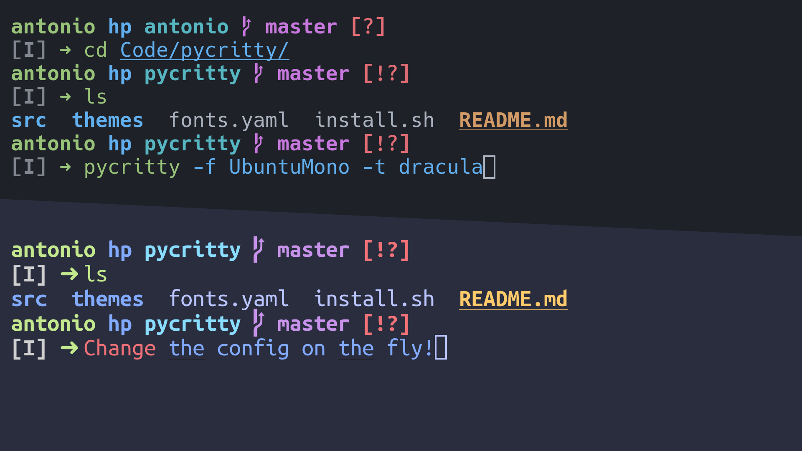

# Pycritty

Change your alacritty config on the fly!



## Installation:

### Install Script

```bash
curl "https://raw.githubusercontent.com/antoniosarosi/pycritty/master/install.sh" | bash
```

### Manual Installation

```bash
# Clone repo
mkdir -p ~/.config/alacritty
cd ~/.config/alacritty
git clone https://github.com/antoniosarosi/pycritty
# Create themes and fonts configs
cp pycritty/config/fonts.yaml fonts.yaml
cp -r pycritty/config/themes themes
# Create executable
mkdir -p ~/.local/bin
ln -s pycritty/src/main.py ~/.local/bin/pycritty
chmod 755 pycritty/src/main.py
# Add ~/.local/bin to $PATH
echo 'export PATH=$PATH:~/.local/bin' >> ~/.bash_profile
```

## Usage:

```bash
pycritty --font UbuntuMono --size 14 --opacity 0.95
# Check all available options
pycritty --help
```

## Fonts Config

Fonts are configured in ```fonts.yaml``` with this format:
```yaml
fonts:
    Alias: Font Name
```

When applied using ```pycritty -f Alias```, the previous format will be
converted into the alacritty equivalent:

```yaml
font:
    normal:
        family: Font Name
    italic:
        family: Font Name
    bold:
        family: Font Name
```

You can also specify a different font for each font type:

```yaml
fonts:
    Alias:
        normal: Normal Font Name
        bold: Bold Font Name
        italic: Italic Font Name
```

Note that the fonts must be installed on your system.

## Theme Config

You can make your own custom themes by creating new theme files with the
correct format, ```themes/custom.yaml``` should look like this:

```yaml
colors:
    # Default colors
    primary:
        background: '0x292d3e'
        foreground: '0xbbc5ff'
    # Normal colors
    normal:
        black:   '0x101010'
        red:     '0xf07178'
        green:   '0xc3e88d'
        yellow:  '0xffcb6b'
        blue:    '0x82aaff'
        magenta: '0xc792ea'
        cyan:    '0x89ddff'
        white:   '0xd0d0d0'
    # Bright colors
    bright:
        black:   '0x434758'
        red:     '0xff8b92'
        green:   '0xddffa7'
        yellow:  '0xffe585'
        blue:    '0x9cc4ff'
        magenta: '0xe1acff'
        cyan:    '0xa3f7ff'
        white:   '0xffffff'
```

Then you can apply it using the name of the file:

```bash
pycritty -t custom
```
